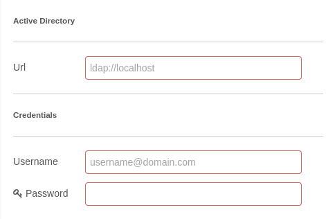
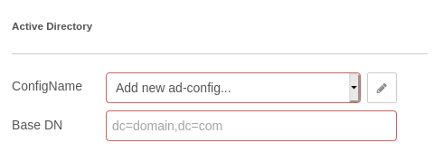

ActiveDirectory for Node-RED
=========

[](https://github.com/NoeSamaille/node-red-contrib-activedirectory/actions/workflows/test.yml)
[](https://github.com/NoeSamaille/node-red-contrib-activedirectory/actions/workflows/codeql-analysis.yml)
[](https://www.npmjs.com/package/node-red-contrib-activedirectory)
[](https://www.npmjs.com/package/node-red-contrib-activedirectory)
[](https://github.com/NoeSamaille/node-red-contrib-activedirectory/issues)

node-red-contrib-activedirectory is a [Node-RED](https://nodered.org/) nodes collection for Microsoft Active Directory. It is based on the [activedirectory2](https://www.npmjs.com/package/activedirectory2) ldapjs client for auth (authentication) and authZ (authorization) for Microsoft Active Directory (documentation [here](https://www.npmjs.com/package/activedirectory2)).

If you want to contribute in order to add brand new features and/or nodes, do not hesitate to join and submit your merge requests!

---

:heavy_exclamation_mark: **Breaking CHANGES FROM v0.2 to v0.3** :heavy_exclamation_mark:

A `config` node holds the connection parameters now.
Please, redeploy your `activdirecory`nodes.

---


Getting started
--------------

1. Install Node-RED ([more](https://nodered.org/docs/getting-started/installation)):
```sh
sudo npm install -g node-red
```
2. Go to your node-RED conf directory (basically `~/.node-red`)
```sh
npm install node-red-contrib-activedirectory
```
3. There you go! You can run Node-RED with:
```sh
node-red
```

Documentation
--------------
+ [Connection](#connection)
+ [findUser](#finduser)
+ [findGroup](#findgroup)
+ [query](#query)
+ [examples](https://github.com/NoeSamaille/node-red-contrib-activedirectory/wiki/Examples)

---------------------------------------

<a id="connection"></a>
### Connection

Every node requires LDAP configuration/credentials (configured in the config-node) to create an instance of the client configured according to the following options:
+ `url` {string}: Active Directory server to connect to, e.g. `ldap://ad.example.com`.
+ `username` {string}: An account name capable of performing the operations desired.
+ `password` {string}: Password for the given `username`.



The configuration for the baseDN has to be configured seperately for each node.
+ `baseDN` {string}: Mandatory, The root DN from which all searches will be performed, e.g. `dc=example,dc=com`.



<a id="finduser"></a>
### findUser


Connects to a Microsoft Active Directory and returns the user corresponding to the username/DN set in `msg.payload`.

__Inputs__

+ `msg.payload` {string}: the AD username of the user we want to get information. It also works with DN.
+ `msg.ad_attributes` {JSON Object}: the attributes we want to return for users and groups. By default:
```json
{
  "user": [
      "dn", "distinguishedName",
      "userPrincipalName", "sAMAccountName", "mail",
      "lockoutTime", "whenCreated", "pwdLastSet", "userAccountControl",
      "employeeID", "sn", "givenName", "initials", "cn", "displayName",
      "comment", "description", "url"
  ],
  "group": [
      "dn", "cn", "description", "distinguishedName", "objectCategory"
  ]
}
```
+ `msg.tlsOptions` {JSON Object}: (Optional) Additional options passed to TLS connection layer when connecting via ldaps://. (See: [TLS docs for node.js](https://nodejs.org/api/tls.html#tls_tls_connect_options_callback)).

__Outputs__

+ `msg.payload` {JSON Object}: the standard output of the command, a JSON object that contains all the information about the user.

<a id="findgroup"></a>
### findGroup


Connects to a Microsoft Active Directory and returns the group corresponding to the groupname/DN set in `msg.payload`.

__Inputs__

+ `msg.payload` {string}: the AD groupname of the group we want to get information. It also works with DN.
+ `msg.ad_attributes` {JSON Object}: the attributes we want to return for users and groups. By default:
```json
{
  "user": [
      "dn", "distinguishedName",
      "userPrincipalName", "sAMAccountName", "mail",
      "lockoutTime", "whenCreated", "pwdLastSet", "userAccountControl",
      "employeeID", "sn", "givenName", "initials", "cn", "displayName",
      "comment", "description", "url"
  ],
  "group": [
      "dn", "cn", "description", "distinguishedName", "objectCategory"
  ]
}
```
+ `msg.tlsOptions` {JSON Object}: (Optional) Additional options passed to TLS connection layer when connecting via ldaps://. (See: [TLS docs for node.js](https://nodejs.org/api/tls.html#tls_tls_connect_options_callback)).

__Outputs__

+ `msg.payload` {JSON Object}: the standard output of the command, a JSON object that contains all the information about the group.

<a id="query"></a>
### query


Connects to a Microsoft Active Directory and returns the result of the AD query input set in `msg.payload`.

__Inputs__
+ `msg.payload` {string}: an LDAP query (more information: [AD Search FilterSyntax](https://docs.microsoft.com/en-us/windows/win32/adsi/search-filter-syntax)).
+ `msg.ad_attributes` {JSON Object}: the attributes we want to return for users and groups. By default:
```json
{
  "user": [
      "dn", "distinguishedName",
      "userPrincipalName", "sAMAccountName", "mail",
      "lockoutTime", "whenCreated", "pwdLastSet", "userAccountControl",
      "employeeID", "sn", "givenName", "initials", "cn", "displayName",
      "comment", "description", "url"
  ],
  "group": [
      "dn", "cn", "description", "distinguishedName", "objectCategory"
  ]
}
```
+ `msg.tlsOptions` {JSON Object}: (Optional) Additional options passed to TLS connection layer when connecting via ldaps://. (See: [TLS docs for node.js](https://nodejs.org/api/tls.html#tls_tls_connect_options_callback)).

__Outputs__

+ `msg.payload` {JSON Object}: the standard output of the command, a JSON object that contains result of the AD query input.
